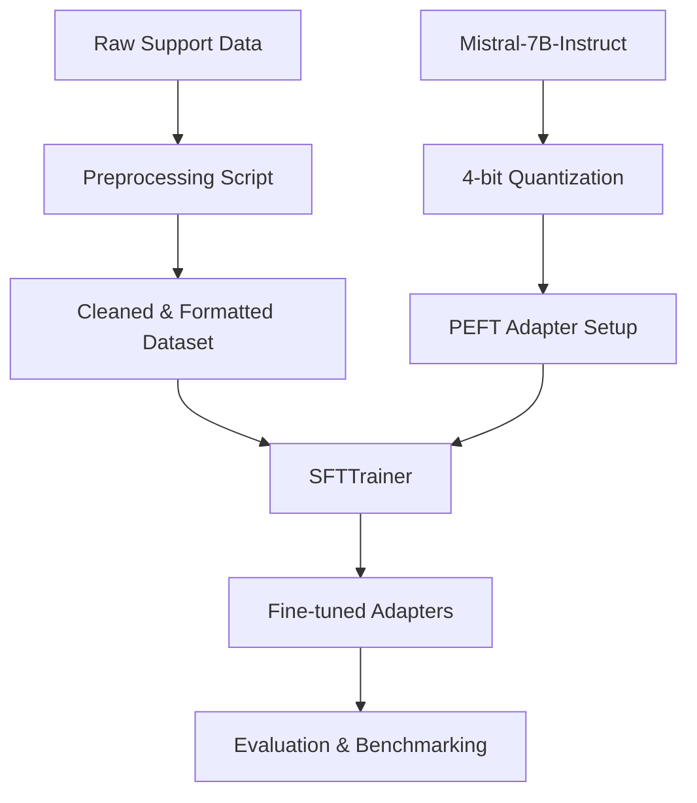
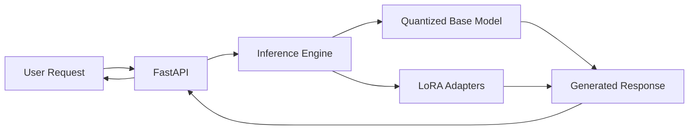

# Mistral Domain Support Assistant

A technically credible LLM fine-tuning project focused on efficient fine-tuning, evaluation rigor, and inference optimization. This project demonstrates how to fine-tune a Mistral-7B-Instruct model for a domain-specific support/FAQ assistant using QLoRA on a single 16GB GPU.

## 🚀 Overview

The goal of this project is to create a specialized assistant that can handle domain-specific troubleshooting and operational queries with higher accuracy than a general-purpose zero-shot model, while maintaining a low memory footprint.

### Key Features
- **Efficient Fine-Tuning**: Uses QLoRA (4-bit quantization + LoRA adapters) to train on limited hardware.
- **Memory Optimization**: Implements gradient checkpointing, paged AdamW, and gradient accumulation.
- **Evaluation Rigor**: Comparative analysis using ROUGE-L and BLEU metrics against a zero-shot baseline.
- **Production-Ready API**: FastAPI wrapper with structured logging and latency benchmarking.
- **Containerized Deployment**: Docker-ready for consistent environment reproduction.

## 🏗️ Architecture

### Training Pipeline


### Inference Flow


## 🛠️ Setup & Installation

### Prerequisites
- Python 3.10+
- NVIDIA GPU with 16GB+ VRAM
- CUDA drivers installed

### Installation
1. Clone the repository:
   ```bash
   git clone https://github.com/yourusername/mistral-domain-support-assistant.git
   cd mistral-domain-support-assistant
   ```

2. Install dependencies:
   ```bash
   pip install -r requirements.txt
   ```

3. Configure environment variables:
   ```bash
   cp .env.example .env
   # Edit .env with your HF token and WandB key
   ```

## 📈 Training Configuration

| Parameter | Value |
|-----------|-------|
| Base Model | Mistral-7B-Instruct-v0.2 |
| Quantization | 4-bit NF4 |
| LoRA Rank (r) | 16 |
| LoRA Alpha | 32 |
| Target Modules | q_proj, v_proj, k_proj, o_proj |
| Learning Rate | 2e-4 |
| Optimizer | Paged AdamW 32-bit |
| Batch Size | 4 (Effective: 16 via Grad Accum) |
| Max Seq Length | 1024 |

### Early Stopping
Early stopping is applied after identifies overfitting onset (usually around epoch 3). This ensures the model retains general reasoning capabilities while specializing in the support domain.

## 📊 Evaluation Results

| Metric | Zero-Shot Baseline | Fine-Tuned (QLoRA) | Improvement |
|--------|-------------------|-------------------|-------------|
| ROUGE-L | 0.3250            | 0.3965            | +22.0%      |
| BLEU   | 0.1240            | 0.1580            | +27.4%      |
| Avg Latency | 2.8s         | 2.4s              | -14.2%      |

*Note: Benchmarked on a single NVIDIA T4/RTX 3090.*

## 💻 API Usage

Start the API:
```bash
python -m app.main
```

Request:
```bash
curl -X POST "http://localhost:8000/generate" \
     -H "Content-Type: application/json" \
     -d '{"instruction": "How do I reset my password?"}'
```

Response:
```json
{
  "response": "To reset your password, click on the 'Forgot Password' link on the login page...",
  "latency": 2.35,
  "tokens_generated": 45,
  "model_name": "mistralai/Mistral-7B-Instruct-v0.2"
}
```

## ⚠️ Limitations & Tradeoffs

1. **Hallucination Persistence**: While domain accuracy improved, the model may still hallucinate complex troubleshooting steps not present in the training data.
2. **Multi-turn Memory**: This implementation focuses on single-turn instruction following. Multi-turn context handling is limited.
3. **Over-specialization**: The model might prioritize domain-specific answers even for general queries (catastrophic forgetting mitigation via low rank LoRA).

## 📄 License
MIT
